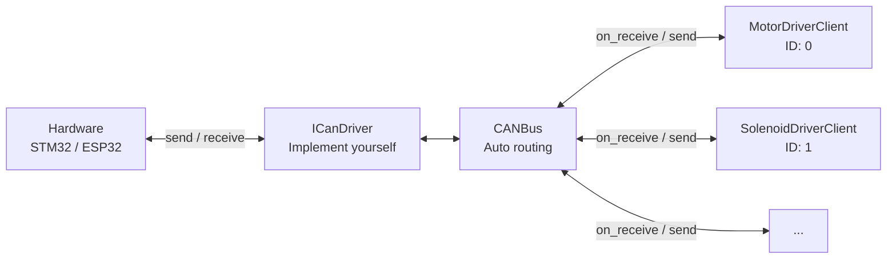
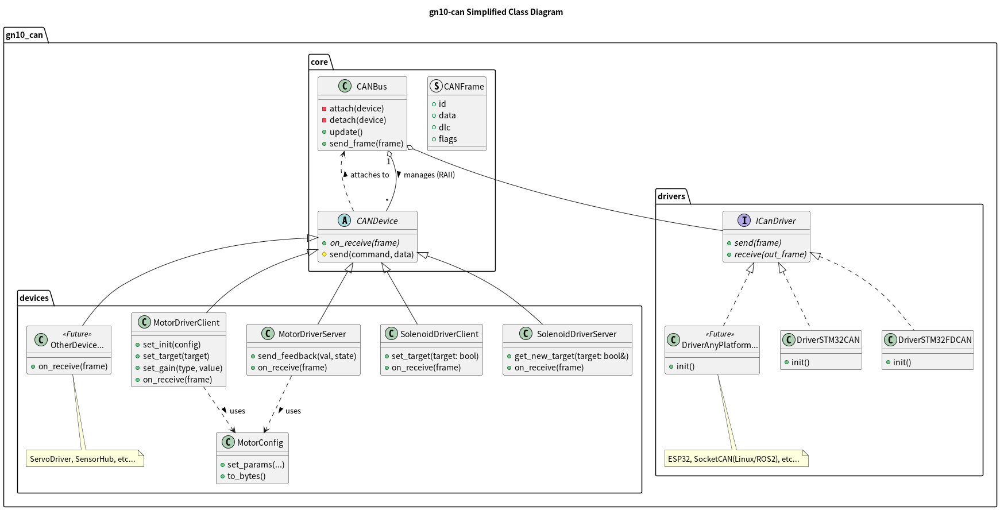

# GN10 CAN Library
[](https://github.com/ararobo/gn10-can/actions/workflows/test.yml)


[日本語 (Japanese)](README_ja.md)

CAN bus data models, ID definitions, and handling classes.

Primarily intended for robot contests, this library simplifies firmware development for custom PCBs by centralizing CAN data frame and ID definitions. It aims to reduce configuration effort while enhancing reliability, reproducibility, and development efficiency.

## Supported Platforms

This library is designed to work across multiple platforms:

- **ESP32** - Arduino environment
- **STM32** - CMake
- **ROS 2** - CMake/Linux

## Overview

This library is focused on **CAN frame definitions and ID management** and does not include communication implementation (send/receive handling).
Understanding the relationship between three key classes lets you get started without confusion.

| Class | Role |
| :--- | :--- |
| `ICanDriver` | Hardware-specific send/receive. Implement one per MCU |
| `CANBus` | Receives frames via the driver and dispatches them to each device |
| `CANDevice` | Protocol handling per device (motor, solenoid, etc.). Auto-registered to `CANBus` |



> One instance = one `dev_id`. If you have 4 motors, create 4 `MotorDriverClient` instances.

## Development Environment Setup

### Common
Install **CMake Tools** extension for VSCode.

### Ubuntu
```bash
sudo apt update
sudo apt install build-essential cmake ninja-build
```

### Windows(for STM32)

Install STM32CubeCLT.

### Windows(Generic)

Install a C++ Compiler(Visual Studio or MinGW), CMake, and Ninja, and add them to your PATH.

## Build

### Generic C++ (CMake)

```bash
mkdir build && cd build
cmake -DBUILD_FOR_ROS2=OFF .. # -DCMAKE_BUILD_TYPE=Release
cmake --build .
```
test
```bash
mkdir build && cd build
cmake -DBUILD_FOR_ROS2=OFF -DBUILD_TESTS=ON .. # -DCMAKE_BUILD_TYPE=Release
cmake --build .
ctest  # Run tests
```

### ROS 2 (Colcon)

```bash
colcon build --packages-select gn10_can
```
test
```bash
colcon test --packages-select gn10_can
colcon test-result --all
```

## Usage

### 1. Implement Driver Interface
You need to implement `gn10_can::drivers::ICanDriver` for your specific hardware (e.g., STM32, ESP32 , SocketCAN, etc.).

```cpp
#include "gn10_can/drivers/driver_interface.hpp"

class MyCANDriver : public gn10_can::drivers::ICanDriver {
public:
    bool send(const gn10_can::CANFrame& frame) override {
        // Implement hardware send
        return true;
    }
    bool receive(gn10_can::CANFrame& out_frame) override {
        // Implement hardware receive
        return true;
    }
};
```

### 2. Setup Bus and Devices

```cpp
#include "gn10_can/core/can_bus.hpp"
#include "gn10_can/devices/motor_driver_client.hpp"
#include "gn10_can/devices/solenoid_driver_client.hpp"

// ... inside your main loop or setup ...

MyCANDriver driver;
// 1. Initialize Bus directly with the driver
gn10_can::CANBus bus(driver);

// 2. Initialize Devices
// RAII: Devices automatically attach to the Bus on construction
// and detach on destruction. No manual registration needed.
gn10_can::devices::MotorDriverClient motor(bus, 0);       // Motor Driver (ID: 0)
gn10_can::devices::SolenoidDriverClient solenoid(bus, 1); // Solenoid Driver (ID: 1)

// 3. Send init commands
// ⚠️ Motor will NOT move until set_init() is sent
gn10_can::devices::MotorConfig motor_config;
motor_config.set_max_duty_ratio(1.0f);
motor_config.set_encoder_type(gn10_can::devices::EncoderType::None);
motor.set_init(motor_config);

solenoid.set_init();  // No arguments required

// Main loop
while (true) {
    // Process incoming messages.
    // (Note: You can also call bus.update() directly in the CAN receive
    //  interrupt or in the driver's receive callback function for lower latency.)
    bus.update();

    // Send commands
    motor.set_target(1.0f);  // Set target velocity/position (-1.0f ~ 1.0f)

    // Solenoid target: uint8_t where each bit controls one solenoid
    solenoid.set_target(static_cast<uint8_t>(0b00000001));  // Turn on solenoid 0

    // Or use std::array<bool, 8>:
    // std::array<bool, 8> states{true, false, false, false, false, false, false, false};
    // solenoid.set_target(states);

    // ... your application logic ...
}
```

## Documentation

| Document | Description |
| :--- | :--- |
| [Getting Started](docs/getting-started.md) | Build instructions, minimal example, Client vs Server usage |
| [Architecture](docs/architecture.md) | Design rationale, RAII lifetime rules, Client/Server pattern, CAN ID layout |
| [Porting Guide](docs/porting-guide.md) | Adding a new MCU driver or new device class |
| [Testing Guide](docs/testing.md) | Running tests, using MockDriver to inject frames |
| [Class Reference](docs/gn10-can-class.md) | Class overview and UML diagram |
| [ServoDriver Guide](docs/servo-driver.md) | ServoDriverClient/Server implementation walkthrough |
| [Coding Rules](docs/coding-rules.md) | Naming conventions, constraints, and comment style |

## Project Structure
```text
gn10-can/
├── include/gn10_can/
│   ├── core/        # Core logic (Bus, Device base, Frame)
│   ├── devices/     # Device implementations (MotorDriver, etc.)
│   ├── drivers/     # Hardware interfaces
│   └── utils/       # Utilities (Converter, etc.)
├── src/             # Implementation files
├── tests/           # Unit tests (GTest)
├── uml/             # UML diagrams
└── CMakeLists.txt   # Build configuration
```

## Class Diagram
Class diagram (simplified)



[Class diagram detail](uml/class_diagram.png)

## Integration

### CMake (`FetchContent` or Submodule)
Add the following to your `CMakeLists.txt`:
```cmake
# Example: If placed under 'libs' folder
add_subdirectory(libs/gn10-can)
target_link_libraries(<your_target_name> PRIVATE gn10_can)
```

## Development Rules

[Coding Rules](docs/coding-rules.md)

## License
This project is licensed under the Apache-2.0 - see the [LICENSE](LICENSE) file for details.

## Maintainer
- Gento Aiba
- Koichiro Watanabe
- Ayu Kanai
- Akeru Kamagata
