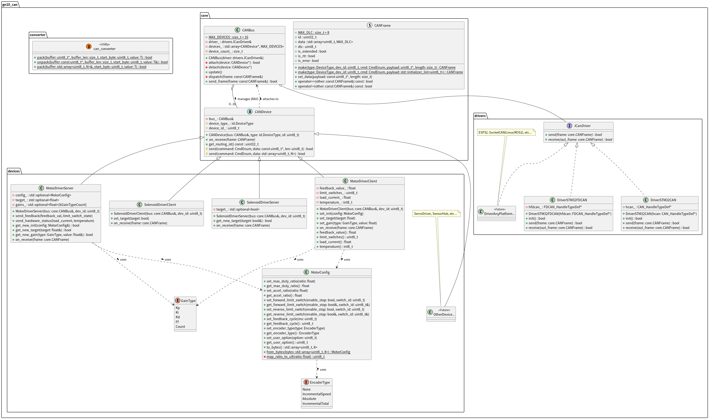

# GN10 CAN Library
[](https://github.com/ararobo/gn10-can/actions/workflows/test.yml)


CANバスのデータモデル、ID定義、およびハンドリングクラス。

主にロボットコンテストでの使用を想定し、自作の基板類にファームウェアを作成する際、CAN通信時のデータフレーム定義やID定義の手間を減らし、高い信頼性と再現性、開発効率向上の為、CAN通信のデータやIDをこのライブラリで一括管理できます。

## 対応プラットフォーム

このライブラリは、複数のプラットフォームで動作するように設計されています：

- **ESP32** - Arduino環境
- **STM32** - Makefile/CubeIDE
- **ROS 2** - CMake/Linux

## 開発環境構築

### 共通

VSCodeに拡張機能：以下をインストール
- CMake Tools(Microsoft)

### Ubuntu

下記コマンドをターミナルで実行

```bash
sudo apt update
sudo apt install build-essential cmake ninja-build
```

### Windows(for STM32)

STM32CubeCLTをインストール

### Windows(Generic)

C++コンパイラ（Visual Studio or MinGW）、CMake、Ninjaをインストールしてパスを通す


## ビルドとテスト

### 汎用 C++ (CMake)

```bash
mkdir build && cd build
cmake -DBUILD_FOR_ROS2=OFF -DBUILD_TESTS=ON .. # -DCMAKE_BUILD_TYPE=Release
cmake --build .
ctest  # テストの実行
```

### ROS 2 (Colcon)

```bash
colcon build --packages-select gn10_can
colcon test --packages-select gn10_can
colcon test-result --all
```

## 使用方法

### 1. ドライバーインターフェースの実装
特定のハードウェア（例：STM32、ESP32、SocketCANなど）用に `gn10_can::drivers::DriverInterface` を実装する必要があります。

```cpp
#include "gn10_can/drivers/driver_interface.hpp"

class MyCANDriver : public gn10_can::drivers::DriverInterface {
public:
    bool send(const gn10_can::CANFrame& frame) override {
        // ハードウェア送信の実装
        return true;
    }
    bool receive(gn10_can::CANFrame& out_frame) override {
        // ハードウェア受信の実装
        return true;
    }
};
```

### 2. マネージャーとデバイスのセットアップ

```cpp
#include "gn10_can/core/can_bus.hpp"
#include "gn10_can/devices/motor_driver.hpp"

// ... メインループまたはセットアップ内 ...

MyCANDriver driver;
gn10_can::CANBus bus(driver);

// ID 0x200 のモータードライバーインスタンスを作成
// RAIIにより、作成時に自動的にバスへ登録されます（手動登録は不要です）
gn10_can::devices::MotorDriver motor(bus, 0x200);

// コマンドの送信
motor.send_target(100.0f); // 目標速度/位置を設定

// メインループ
while (true) {
    // 受信処理
    // (Note: CAN受信割り込み内などで bus.update() を呼ぶことで低遅延化も可能です)
    bus.update();

    // ... アプリケーションロジック ...
}
```

// メインループ
while (true) {
    // 受信メッセージの処理
    // (注: 低遅延のために、CAN受信割り込みやドライバーの受信コールバック関数内で
    //  manager.update() を直接呼び出すことも可能です)
    manager.update();

    // ... アプリケーションロジック ...
}
```

## プロジェクト構造
```text
gn10-can/
├── include/gn10_can/
│   ├── core/        # コアロジック (Manager, Device base, Frame)
│   ├── devices/     # デバイス実装 (MotorDriver, etc.)
│   ├── drivers/     # ハードウェアインターフェース
│   └── utils/       # ユーティリティ (Converter, etc.)
├── src/             # 実装ファイル
├── tests/           # ユニットテスト (GTest)
├── uml/             # UML図
└── CMakeLists.txt   # ビルド設定
```

## クラス図



## プロジェクトへの取り込み
`git submodule`でプロジェクトに追加し、CMakeLists.txtに以下を追記してください。
```cmake
# 例: libsフォルダ下に配置した場合
add_subdirectory(libs/gn10-can)
target_link_libraries(${PROJECT_NAME} PRIVATE gn10_can)
```

## 開発ルール

### 1. 命名規則
変数名と関数名は説明的である必要があります。基本的には **Google C++ Style Guide** に従います：
- **クラス/構造体名**: `PascalCase` (例: `SpeedMsg`, `BatteryStatus`)
- **関数/変数名**: `snake_case` (例: `get_id()`, `target_velocity`)
- **定数/列挙値**: `kPascalCase` または `ALL_CAPS` (例: `kMaxSpeed`, `BATTERY_LOW`)
- **プライベートメンバ変数**: ローカル変数と区別するために、末尾にアンダースコアを付ける必要があります (例: `speed_`, `voltage_`)。

### 2. コードフォーマット
- IDEのデフォルト設定に依存しないでください。
- すべてのコードは **Clang-Format** を使用してフォーマットする必要があります。
- ルートディレクトリに `.clang-format` ファイルが用意されています。保存時にこれを使用するようにエディタを設定してください。

### 3. 標準ライブラリのみ使用
クロスプラットフォームの互換性を確保するため：
- `include/gn10_can/` 以下のファイルは、`<Arduino.h>`、`<rclcpp/rclcpp.h>`、`<hal_driver.h>` などのプラットフォーム固有のヘッダーを含んでは**いけません**。
- 標準C++ヘッダーのみが許可されます：`<cstdint>`, `<cstring>`, `<cmath>`, `<algorithm>` など。

### 4. メモリ管理（動的割り当てなし）
- 組み込みシステム（STM32/ESP32）での安定性を確保するため、モデル内での動的メモリ割り当て（`new`, `malloc`, `std::vector`, `std::string`）の使用は避けてください。
- 固定サイズの配列とプリミティブ型を使用してください。

### 5. 言語ポリシー（要検討）
- **コードとコミット**: 英語。
- **ドキュメント**: 英語（日本語訳は許可）。
- **内部コメント**: 日本語

## ライセンス
このプロジェクトは GNU General Public License v3.0 (GPL-3.0) の下でライセンスされています - 詳細は [LICENSE](LICENSE) ファイルを参照してください。
