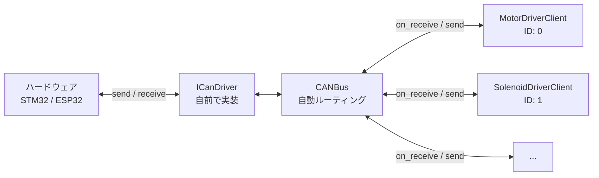

# GN10 CAN Library
[](https://github.com/ararobo/gn10-can/actions/workflows/test.yml)


CANバスのデータモデル、ID定義、およびハンドリングクラス。

主にロボットコンテストでの使用を想定し、自作の基板類にファームウェアを作成する際、CAN通信時のデータフレーム定義やID定義の手間を減らし、高い信頼性と再現性、開発効率向上の為、CAN通信のデータやIDをこのライブラリで一括管理できます。

## 対応プラットフォーム

このライブラリは、複数のプラットフォームで動作するように設計されています：

- **ESP32** - Arduino環境
- **STM32** - CMake
- **ROS 2** - CMake/Linux

## 概要

このライブラリは **「データフレーム定義・ID管理」** に特化しており、通信の実装（送受信処理）は含みません。
3つの主要クラスの関係を理解することで、迷わず使い始められます。

| クラス | 役割 |
| :--- | :--- |
| `ICanDriver` | ハードウェア依存の送受信処理。マイコンごとに自前で実装する |
| `CANBus` | ドライバーを使って受信したフレームを各デバイスに配送する |
| `CANDevice` | 各デバイス（モーター・ソレノイド等）のプロトコル処理。`CANBus` に自動登録される |


```mermaid
flowchart LR
    HW[ハードウェア\nSTM32 / ESP32] <-->|"send / receive"| D[ICanDriver\n自前で実装]
    D <--> B[CANBus\n自動ルーティング]
    B <-->|"on_receive / send"| M[MotorDriverClient\nID: 0]
    B <-->|"on_receive / send"| S[SolenoidDriverClient\nID: 1]
    B <-->|"on_receive / send"| N[...]
```

> デバイスは1インスタンス = 1 `dev_id` です。モーターが4つあれば `MotorDriverClient` を4つ作成します。

## 開発環境構築

### 共通

VSCodeに拡張機能：以下をインストール
- CMake Tools(Microsoft)

### Ubuntu

下記コマンドをターミナルで実行

```bash
sudo apt update
sudo apt install build-essential cmake ninja-build
```

### Windows(for STM32)

STM32CubeCLTをインストール

### Windows(Generic)

C++コンパイラ（Visual Studio or MinGW）、CMake、Ninjaをインストールしてパスを通す


## ビルドとテスト

### 汎用 C++ (CMake)

```bash
mkdir build && cd build
cmake -DBUILD_FOR_ROS2=OFF -DBUILD_TESTS=ON .. # -DCMAKE_BUILD_TYPE=Release
cmake --build .
ctest  # テストの実行
```

### ROS 2 (Colcon)

```bash
colcon build --packages-select gn10_can
colcon test --packages-select gn10_can
colcon test-result --all
```

## 使用方法

### 1. ドライバーインターフェースの実装
特定のハードウェア（例：STM32、ESP32、SocketCANなど）用に `gn10_can::drivers::ICanDriver` を実装する必要があります。

```cpp
#include "gn10_can/drivers/driver_interface.hpp"

class MyCANDriver : public gn10_can::drivers::ICanDriver {
public:
    bool send(const gn10_can::CANFrame& frame) override {
        // ハードウェア送信の実装
        return true;
    }
    bool receive(gn10_can::CANFrame& out_frame) override {
        // ハードウェア受信の実装
        return true;
    }
};
```

### 2. バスとデバイスのセットアップ

```cpp
#include "gn10_can/core/can_bus.hpp"
#include "gn10_can/devices/motor_driver_client.hpp"
#include "gn10_can/devices/solenoid_driver_client.hpp"

// ... メインループまたはセットアップ内 ...

MyCANDriver driver;
// 1. バスを初期化（ドライバーを依存注入）
gn10_can::CANBus bus(driver);

// 2. デバイスの初期化
// RAII: コンストラクタで自動的にバスに接続され、デストラクタで切断されます。
// 手動での登録は不要です。
gn10_can::devices::MotorDriverClient motor(bus, 0);       // モータードライバー (ID: 0)
gn10_can::devices::SolenoidDriverClient solenoid(bus, 1); // ソレノイドドライバー (ID: 1)

// 3. 初期化コマンドの送信
// ⚠️ set_init() を送信するまでモーターは動きません
gn10_can::devices::MotorConfig motor_config;
motor_config.set_max_duty_ratio(1.0f);
motor_config.set_encoder_type(gn10_can::devices::EncoderType::None);
motor.set_init(motor_config);

solenoid.set_init();  // ソレノイドは引数なし

// メインループ
while (true) {
    // 受信メッセージの処理
    // (注: 低遅延のために、CAN受信割り込みやドライバーの受信コールバック関数内で
    //  bus.update() を直接呼び出すことも可能です)
    bus.update();

    // コマンドの送信
    motor.set_target(1.0f);  // 目標速度/位置を設定 (-1.0f ~ 1.0f)

    // ソレノイドは uint8_t (各ビットが各ソレノイドのON/OFF) で指定
    solenoid.set_target(static_cast<uint8_t>(0b00000001));  // ソレノイド0をON

    // または std::array<bool, 8> で指定
    // std::array<bool, 8> states{true, false, false, false, false, false, false, false};
    // solenoid.set_target(states);

    // ... アプリケーションロジック ...
}
```

## ドキュメント

| ドキュメント | 内容 |
| :--- | :--- |
| [Getting Started](docs/getting-started.md) | ビルド手順・最小構成コード・Client/Server の使い分け |
| [Architecture](docs/architecture.md) | 設計意図・RAII・Client/Server パターン・CAN ID 設計 |
| [Porting Guide](docs/porting-guide.md) | 新マイコン向けドライバ追加・新デバイス追加の手順 |
| [Testing Guide](docs/testing.md) | テスト実行方法・MockDriver の使い方 |
| [Class Reference](docs/gn10-can-class.md) | クラス一覧・UML クラス図 |
| [ServoDriver ガイド](docs/servo-driver.md) | ServoDriverClient/Server の実装解説 |
| [Coding Rules](docs/coding-rules.md) | 命名規則・制約・ドキュメント規約 |

## プロジェクト構造
```text
gn10-can/
├── include/gn10_can/
│   ├── core/        # コアロジック (Bus, Device base, Frame)
│   ├── devices/     # デバイス実装 (MotorDriver, etc.)
│   ├── drivers/     # ハードウェアインターフェース
│   └── utils/       # ユーティリティ (Converter, etc.)
├── src/             # 実装ファイル
├── tests/           # ユニットテスト (GTest)
├── uml/             # UML図
└── CMakeLists.txt   # ビルド設定
```

## クラス図
クラス図（簡略化済み）


[クラス図の詳細](uml/class_diagram.png)

## プロジェクトへの取り込み
`git submodule`でプロジェクトに追加し、CMakeLists.txtに以下を追記してください。
```cmake
# 例: libsフォルダ下に配置した場合
add_subdirectory(libs/gn10-can)
target_link_libraries(${PROJECT_NAME} PRIVATE gn10_can)
```

## コーディング規約

[コーディング規約](docs/coding-rules.md)

## ライセンス
このプロジェクトはApache-2.0の下でライセンスされています - 詳細は [LICENSE](LICENSE) ファイルを参照してください。

## 協力者・著作者
- Gento Aiba
- Koichiro Watanabe
- Ayu Kanai
- Akeru Kamagata
