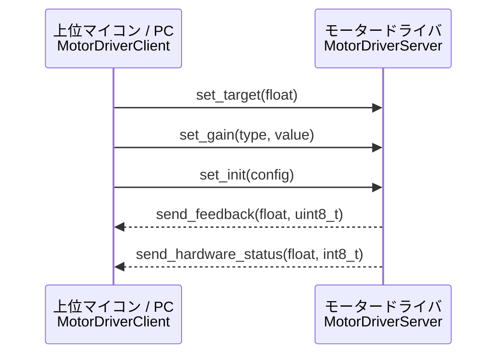

# Getting Started

このドキュメントでは、`gn10-can` ライブラリを用いて最短でCANデバイスを動作させる手順を説明します。

---

## 目次

1. [前提条件](#1-前提条件)
2. [ビルド](#2-ビルド)
3. [基本的な使い方](#3-基本的な使い方)
4. [Client と Server の使い分け](#4-client-と-server-の使い分け)
5. [次のステップ](#5-次のステップ)

---

## 1. 前提条件

| 環境 | 要件 |
| :--- | :--- |
| C++ | C++17 以上 |
| CMake | 3.20 以上 |
| ビルドツール | Ninja (推奨) / Make |

---

## 2. ビルド

基本的にVSCodeで好きなCMake Presetを選び、Buildボタンを押せば良いです。

コマンドラインでやるなら以下です。

### Linux (テスト・開発用)

```bash
# 設定
cmake --preset linux-ninja

# ビルド
cmake --build build/linux_ninja
```

### STM32 クロスコンパイル

```bash
cmake --preset stm32-cross
cmake --build build/stm32
```

---

## 3. 基本的な使い方

`gn10-can` ライブラリを使う際の最小構成を示します。

### 3.1 ドライバの準備

実機では `DriverSTM32CAN` または `DriverSTM32FDCAN` を使います。
テスト・シミュレーションでは後述の `MockDriver` が利用できます。

```cpp
#include "gn10_can/drivers/driver_interface.hpp"

// DriverSTM32CAN などの具象クラスを用意する (実機の場合)
// DriverSTM32CAN driver{hcan};
```

### 3.2 CANBus の構築

`CANBus` はドライバへの参照を受け取ります。
**`CANBus` のインスタンスは `CANDevice` より先に生存していなければなりません。**

```cpp
#include "gn10_can/core/can_bus.hpp"

gn10_can::CANBus bus{driver};
```

### 3.3 デバイスのアタッチ

`CANDevice` を継承したクラス（例: `MotorDriverClient`）をインスタンス化するだけで、
コンストラクタが自動的に `bus.attach()` を呼び出します。
手動でアタッチ/デタッチする必要はありません。

```cpp
#include "gn10_can/devices/motor_driver_client.hpp"

gn10_can::devices::MotorDriverClient motor{bus, /*dev_id=*/1};
```

### 3.4 メインループ

`bus.update()` をCAN通信受信時に呼び出すことで、受信フレームが各デバイスに配送されます。

```cpp
void can_callback(int) {
    bus.update();  // 受信フレームを読み取り、適切なデバイスに routing する
}

while (true) {
    // 指令の送信
    motor.set_target(1.0f);

    // フィードバックの読み出し
    float velocity = motor.feedback_value();

    HAL_Delay(10);  // 例: 10ms 周期
}
```

上記コードでは`set_target`を呼び出してモーターが回るような処理を行っていますが、実際には先に`set_init`関数にてモータードライバーの設定を送信する必要が有ります。

### 3.5 完全なサンプルコード

```cpp
#include "gn10_can/core/can_bus.hpp"
#include "gn10_can/devices/motor_driver_client.hpp"
#include "gn10_can/devices/motor_driver_types.hpp"
#include "driver_stm32_can.hpp"  // 実機用ドライバ

// ドライバとバスの初期化
gn10_can::drivers::DriverSTM32CAN driver{hcan1};
gn10_can::CANBus bus{driver};

// デバイスのインスタンス化 (自動でbusにアタッチされる)
gn10_can::devices::MotorDriverClient motor{bus, /*dev_id=*/1};

void can_callback() // CANの受信時に呼び出されるようにしてください
{
    bus.update();  // 受信処理 (毎ループ呼び出す)
}

void setup()
{
    // 初期設定の送信
    gn10_can::devices::MotorConfig config;
    config.set_max_duty_ratio(0.8f);
    config.set_accel_ratio(0.5f);
    config.set_feedback_cycle(10);  // 10ms 周期でフィードバックを要求
    config.set_encoder_type(gn10_can::devices::EncoderType::None);
    motor.set_init(config);
}

void loop()
{
    motor.set_target(1.0f);  // 目標速度を送信(-1.0f ~ 1.0f)

    float velocity = motor.feedback_value();  // 現在速度を取得
}
```

---

## 4. Client と Server の使い分け

`gn10-can` では、同じデバイス（例: モータードライバ）に対して対称的なクラスが2つ存在します。

| クラス | 役割 | 実装先 |
| :--- | :--- | :--- |
| `MotorDriverClient` | **指令を送り、フィードバックを受け取る** | ROS2ノード / 上位マイコン |
| `MotorDriverServer` | **指令を受け取り、フィードバックを送る** | モータードライバ側マイコン |



**どちらも同じ `dev_id` を使います。** ID が一致したフレームが自動的にルーティングされます。

---

## 5. 次のステップ

- 新しいマイコン向けドライバの追加 → [porting-guide.md](porting-guide.md)
- ServoDriver の実装詳細 → [servo-driver.md](servo-driver.md)
- テストの書き方 → [testing.md](testing.md)
- アーキテクチャの詳細 → [architecture.md](architecture.md)
- クラスリファレンス → [gn10-can-class.md](gn10-can-class.md)
