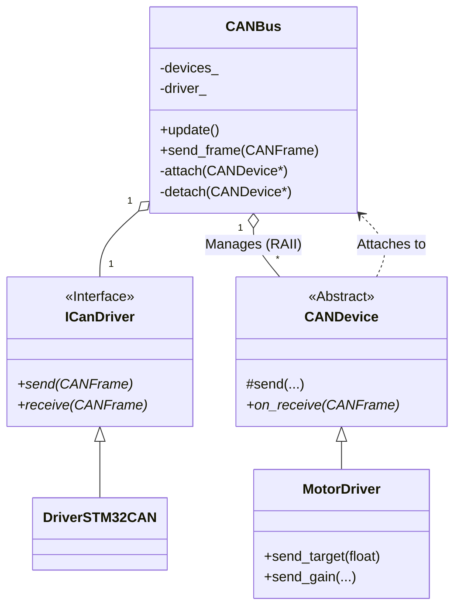

# gn10-can クラス図解・説明書

`gn10-can` ライブラリは、組み込みシステム（特にロボット制御）向けのCAN通信フレームワークです。
このドキュメントでは、主要なクラスとその役割について説明します。

## 概要

`gn10-can` は、ハードウェア依存部（ドライバ）とアプリケーションロジック（デバイス制御）を分離し、拡張性と移植性を高めるように設計されています。
`CANBus` が中心となり、RAIIによって自動登録された `CANDevice` 群に対してメッセージの配送を行います。

---

## 1. Core (核となる機能)

`gn10_can` 名前空間には、通信の根幹を担うクラスが含まれます。

| クラス / 構造体 | 概要 | 詳細 |
| :--- | :--- | :--- |
| **`CANFrame`** | CANフレーム構造体 | CAN ID、データペイロード(最大8バイト)、DLC(データ長)、およびフラグ（拡張ID、RTR、エラー）を保持する基本的なデータ単位です。 |
| **`CANBus`** | 通信管理者クラス | `ICanDriver` を通じて物理層とのやり取りを行い、登録された `CANDevice` へ受信フレームを配送 (`dispatch`) したり、デバイスからの送信要求をドライバに渡します。RAIIによりデバイスの登録・解除を自動管理し、線形探索によるルーティングを行います。 |
| **`CANDevice`** | デバイス基底クラス | 全てのCANデバイス（モーター、センサ等）の親となる抽象クラスです。コンストラクタで自動的に `CANBus` に接続 (`attach`) し、デストラクタで切断 (`detach`) します。特定の受信メッセージをフィルタリングして処理するインターフェース (`on_receive`) を提供します。 |
| **`id` (Namespace)** | ID管理・定義 | CAN IDのビットフィールド定義（デバイスタイプ、ID、コマンド）や、それらをパッキング/アンパッキングするヘルパー関数 (`pack`/`unpack`)、各種列挙型を提供します。 |

### CAN IDの構造 (Standard ID: 11bit)

`gn10_can::id` で定義されるCAN IDの割り当ては以下の通りです。

| ビット範囲 | 名称 | 説明 |
| :--- | :--- | :--- |
| Bit 10-7 (4bit) | **Device Type** | デバイスの種類 (MotorDriver, ServoDriver, etc.) |
| Bit 6-3 (4bit) | **Device ID** | 同種デバイス内の識別子 (0-15) |
| Bit 2-0 (3bit) | **Command** | メッセージの種類 (目標値指令、フィードバック、初期化など) |

---

## 2. Drivers (ハードウェア抽象化)

`gn10_can::drivers` 名前空間は、マイコンごとのハードウェア差異を吸収します。

| クラス | 概要 | 詳細 |
| :--- | :--- | :--- |
| **`ICanDriver`** | ドライバインターフェース | 全てのハードウェアドライバが実装すべき純粋仕戒かん数 (`send`, `receive`) を定義したインターフェースです。 |
| **`DriverSTM32CAN`** | STM32 CANドライバ | STM32の標準CANペリフェラル (bxCAN) 用の実装です。HALライブラリ (`CAN_HandleTypeDef`) をラップします。 |
| **`DriverSTM32FDCAN`** | STM32 FDCANドライバ | STM32 G4/H7シリーズなどの FDCAN ペリフェラル用の実装です。HALライブラリ (`FDCAN_HandleTypeDef`) をラップします。 |

---

## 3. Devices (デバイス制御実装)

`gn10_can::devices` 名前空間には、具体的な機器の制御ロジックが含まれます。

| クラス | 概要 | 詳細 |
| :--- | :--- | :--- |
| **`MotorDriver`** | モータードライバ制御 | `CANDevice` を継承。位置/速度制御指令、ゲイン設定、テレメトリ受信（電流、温度、位置）など、モータードライバとの通信機能を提供します。 |
| **`MotorConfig`** | モーター設定データ | モータードライバの初期化パラメータ（リミットスイッチ設定、最大出力、エンコーダ設定など）を管理し、バイト列へのシリアライズ/デシリアライズを行います。 |
| **`EncoderType`** | エンコーダ種類 (Enum) | None, IncrementalSpeed, Absolute, IncrementalTotal などのエンコーダ設定。 |
| **`GainType`** | 制御ゲイン種類 (Enum) | Kp, Ki, Kd, Ff (フィードフォワード) の識別子。 |

---

## 4. Utilities (ユーティリティ)

`gn10_can::converter` 名前空間には、データ変換用の便利機能が含まれます。

| クラス / namespace | 概要 | 詳細 |
| :--- | :--- | :--- |
| **`can_converter`** | データ変換 | `float` や `int` などの型を、CANフレームのデータ部 (`uint8_t` 配列) にリトルエンディアン等で格納 (`pack`) したり、取り出したり (`unpack`) するテンプレート関数群です。 |

---

## クラス図 (UML概略)

