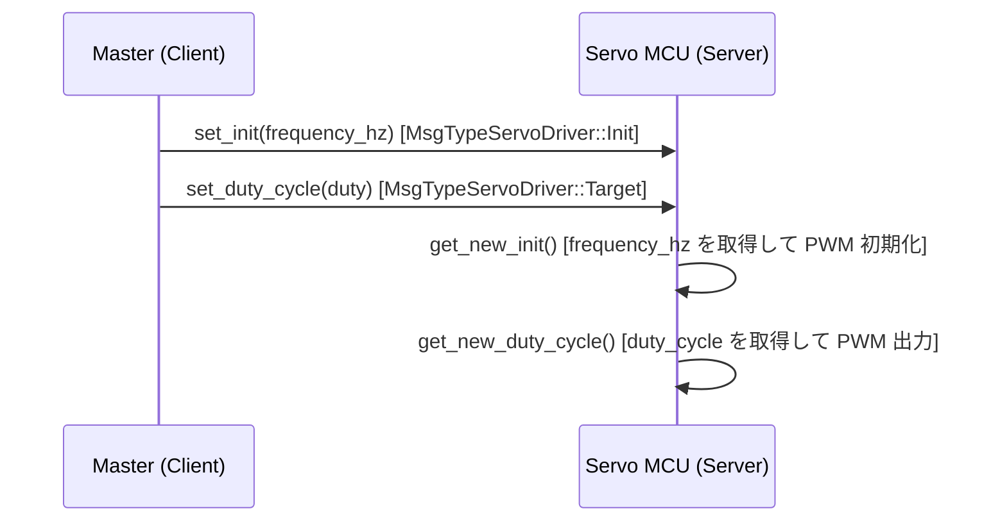
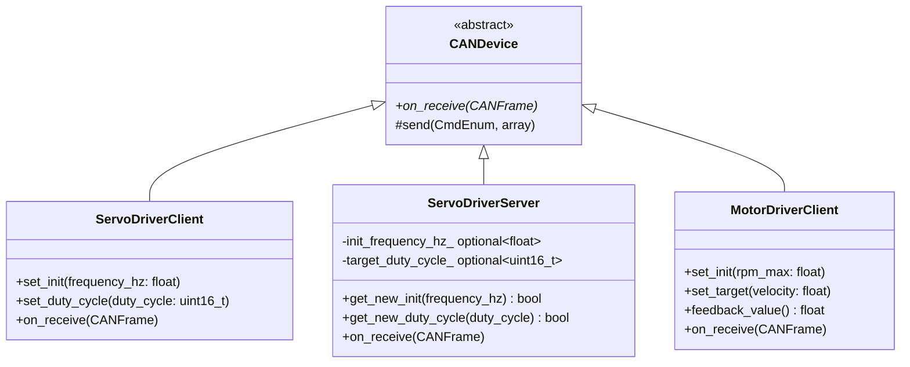

# ServoDriver デバイスクラス実装ガイド

`gn10-can` ライブラリを使い、PWM サーボモーターを CAN 経由で制御する
`ServoDriverClient` / `ServoDriverServer` の実装解説です。

---

## 目次

1. [概要](#1-概要)
2. [CAN ID 割り当て](#2-can-id-割り当て)
3. [ファイル構成](#3-ファイル構成)
4. [ヘッダファイル](#4-ヘッダファイル)
5. [実装ファイル](#5-実装ファイル)
6. [使用例](#6-使用例)
7. [MotorDriver との比較](#7-motordriver-との比較)

---

## 1. 概要

サーボドライバーとマスタ（PC や別マイコン）は CAN バスで接続されます。
マスタ側が **Client**、サーボドライバー側のマイコンが **Server** を実行します。



### MotorDriver との主な違い

| 項目 | MotorDriver | ServoDriver |
|:---|:---|:---|
| 名前空間 | `gn10_can::devices` | `gn10_can::devices` |
| 目標値の型 | `float` (-1.0 ~ 1.0) | `uint16_t` (デューティ比) |
| フィードバック | あり (`Feedback` フレーム) | なし (`on_receive` は空) |
| 初期化 | `set_init(float rpm_max)` | `set_init(float frequency_hz)` |

---

## 2. CAN ID 割り当て

`include/gn10_can/core/can_id.hpp` に以下を追加・確認します。

```cpp
// can_id.hpp (既存)
enum class DeviceType : uint8_t {
    ...
    ServoDriver = 2,   // デバイスタイプ番号
    ...
};

/**
 * @brief サーボドライバーのメッセージ種類（コマンド）
 */
enum class MsgTypeServoDriver : uint8_t {
    Init      = 0,  ///< PWM 周波数の初期設定
    Target    = 1,  ///< デューティ比の更新
    Frequency = 2,  ///< 予約済み（未実装）
};
```

> **注意:** `Frequency = 2` は現時点では使用されていません。将来の拡張用に予約されています。

---

## 3. ファイル構成

```
include/gn10_can/devices/
├── servo_driver_client.hpp   ← Client ヘッダ（マスタ側で include）
└── servo_driver_server.hpp   ← Server ヘッダ（サーボ MCU 側で include）

src/devices/
├── servo_driver_client.cpp   ← Client 実装
└── servo_driver_server.cpp   ← Server 実装
```

---

## 4. ヘッダファイル

### servo_driver_client.hpp

```cpp
#pragma once

#include "gn10_can/core/can_bus.hpp"
#include "gn10_can/core/can_device.hpp"
#include "gn10_can/core/can_frame.hpp"

namespace gn10_can {
namespace devices {

/**
 * @brief サーボドライバー クライアント側制御クラス
 *
 * マスタ（PC / 上位マイコン）に配置し、CAN 経由でサーボを操作する。
 * フィードバックは存在しないため on_receive() は空実装。
 */
class ServoDriverClient : public CANDevice
{
public:
    /**
     * @param bus       CANBus への参照（バスより長く生存してはならない）
     * @param device_id 対象サーボのデバイス ID (0-15)
     */
    ServoDriverClient(CANBus& bus, uint8_t device_id);

    /**
     * @brief PWM 周波数を送信する（最初に一度だけ呼ぶ）
     * @param frequency_hz  PWM 周波数 [Hz]（例: 50.0f for standard servo）
     */
    void set_init(float frequency_hz);

    /**
     * @brief デューティ比を送信する
     * @param duty_cycle  デューティ比の生値（ハードウェア依存の単位）
     */
    void set_duty_cycle(uint16_t duty_cycle);

    /** @brief フィードバックなし。空実装。 */
    void on_receive(const CANFrame& frame) override;
};

} // namespace devices
} // namespace gn10_can
```

### servo_driver_server.hpp

```cpp
#pragma once

#include <optional>

#include "gn10_can/core/can_bus.hpp"
#include "gn10_can/core/can_device.hpp"
#include "gn10_can/core/can_frame.hpp"

namespace gn10_can {
namespace devices {

/**
 * @brief サーボドライバー サーバー側クラス
 *
 * サーボを接続したマイコン上で動作する。
 * on_receive() で CAN フレームを受信してキューに蓄え、
 * メインループから get_new_init() / get_new_duty_cycle() で取り出して使う。
 */
class ServoDriverServer : public CANDevice
{
public:
    /**
     * @param bus       CANBus への参照
     * @param device_id このサーボのデバイス ID (0-15)
     */
    ServoDriverServer(CANBus& bus, uint8_t device_id);

    /**
     * @brief 新しい周波数設定を取得する（メインループから呼ぶ）
     * @param[out] frequency_hz  受信した周波数 [Hz]
     * @return 新しい値があれば true
     */
    bool get_new_init(float& frequency_hz);

    /**
     * @brief 新しいデューティ比を取得する（メインループから呼ぶ）
     * @param[out] duty_cycle  受信したデューティ比
     * @return 新しい値があれば true
     */
    bool get_new_duty_cycle(uint16_t& duty_cycle);

    /** @brief CAN フレームを受信・デコードして内部に保存する */
    void on_receive(const CANFrame& frame) override;

private:
    std::optional<float>    init_frequency_hz_;   ///< 未処理の周波数設定
    std::optional<uint16_t> target_duty_cycle_;   ///< 未処理のデューティ比
};

} // namespace devices
} // namespace gn10_can
```

---

## 5. 実装ファイル

### servo_driver_client.cpp

```cpp
#include "gn10_can/devices/servo_driver_client.hpp"

#include "gn10_can/core/can_id.hpp"
#include "gn10_can/utils/can_converter.hpp"

namespace gn10_can {
namespace devices {

ServoDriverClient::ServoDriverClient(CANBus& bus, uint8_t device_id)
    : CANDevice(bus, id::DeviceType::ServoDriver, device_id)
{
}

void ServoDriverClient::set_init(float frequency_hz)
{
    // 4 バイトに float をパックして Init フレームを送信
    std::array<uint8_t, 4> payload{};
    converter::pack(payload, 0, frequency_hz);
    send(id::MsgTypeServoDriver::Init, payload);
}

void ServoDriverClient::set_duty_cycle(uint16_t duty_cycle)
{
    // 2 バイトに uint16_t をパックして Target フレームを送信
    std::array<uint8_t, 2> payload{};
    converter::pack(payload, 0, duty_cycle);
    send(id::MsgTypeServoDriver::Target, payload);
}

void ServoDriverClient::on_receive(const CANFrame& /*frame*/)
{
    // フィードバックなし
}

} // namespace devices
} // namespace gn10_can
```

### servo_driver_server.cpp

```cpp
#include "gn10_can/devices/servo_driver_server.hpp"

#include "gn10_can/core/can_id.hpp"
#include "gn10_can/utils/can_converter.hpp"

namespace gn10_can {
namespace devices {

ServoDriverServer::ServoDriverServer(CANBus& bus, uint8_t device_id)
    : CANDevice(bus, id::DeviceType::ServoDriver, device_id)
{
}

void ServoDriverServer::on_receive(const CANFrame& frame)
{
    // フレームの CAN ID を解析してコマンド種別を判定
    auto id_fields = id::unpack(frame.id);

    if (id_fields.is_command(id::MsgTypeServoDriver::Init)) {
        float freq = 0.0f;
        if (converter::unpack(frame.data.data(), frame.dlc, 0, freq)) {
            init_frequency_hz_ = freq;
        }
    } else if (id_fields.is_command(id::MsgTypeServoDriver::Target)) {
        uint16_t duty = 0;
        if (converter::unpack(frame.data.data(), frame.dlc, 0, duty)) {
            target_duty_cycle_ = duty;
        }
    }
}

bool ServoDriverServer::get_new_init(float& frequency_hz)
{
    if (!init_frequency_hz_.has_value()) {
        return false;
    }
    frequency_hz = init_frequency_hz_.value();
    init_frequency_hz_.reset();
    return true;
}

bool ServoDriverServer::get_new_duty_cycle(uint16_t& duty_cycle)
{
    if (!target_duty_cycle_.has_value()) {
        return false;
    }
    duty_cycle = target_duty_cycle_.value();
    target_duty_cycle_.reset();
    return true;
}

} // namespace devices
} // namespace gn10_can
```

---

## 6. 使用例

### Client 側（マスタマイコン）

```cpp
#include "gn10_can/core/can_bus.hpp"
#include "gn10_can/devices/servo_driver_client.hpp"
// 各プラットフォームのドライバ
#include "driver_stm32_can.hpp"

int main()
{
    // ドライバと CANBus の初期化
    gn10_can::drivers::DriverSTM32CAN driver(/* hcan, ... */);
    gn10_can::CANBus bus(driver);

    // サーボをデバイス ID 0 として登録
    gn10_can::devices::ServoDriverClient servo(bus, 0);

    // PWM 周波数を設定（標準サーボ: 50 Hz）
    servo.set_init(50.0f);

    // デューティ比を送信（値域はハードウェア依存）
    servo.set_duty_cycle(1500);  // 例: 1500 μs 相当

    while (true) {
        bus.update();
    }
}
```

### Server 側（サーボドライバーマイコン）

```cpp
#include "gn10_can/core/can_bus.hpp"
#include "gn10_can/devices/servo_driver_server.hpp"

// ハードウェア依存 — ユーザーが実装する PWM 関数
extern void pwm_set_frequency(float frequency_hz);
extern void pwm_set_duty(uint16_t duty_cycle);

void app_main()
{
    gn10_can::drivers::DriverSTM32CAN driver(/* hcan, ... */);
    gn10_can::CANBus bus(driver);

    // このサーボのデバイス ID は Client 側と一致させる
    gn10_can::devices::ServoDriverServer servo(bus, 0);

    while (true) {
        bus.update();  // on_receive() が呼ばれる

        // 新しい Init フレームがあれば PWM 周波数を更新
        float freq = 0.0f;
        if (servo.get_new_init(freq)) {
            pwm_set_frequency(freq);
        }

        // 新しい Target フレームがあればデューティ比を更新
        uint16_t duty = 0;
        if (servo.get_new_duty_cycle(duty)) {
            pwm_set_duty(duty);
        }
    }
}
```

---

## 7. MotorDriver との比較

### クラス図



### フレームペイロード設計

| メッセージ | ペイロード | バイト数 | 型 |
|:---|:---|:---|:---|
| `Init` | PWM 周波数 [Hz] | 4 | `float` |
| `Target` | デューティ比 | 2 | `uint16_t` |
| `Frequency` | (予約済み) | - | - |

### 名前空間

`ServoDriverClient` / `ServoDriverServer` はいずれも `gn10_can::devices` に属します。
`MotorDriverClient` と同じ名前空間です。

```cpp
gn10_can::devices::MotorDriverClient motor(bus, 0);
gn10_can::devices::ServoDriverClient servo(bus, 0);
```
